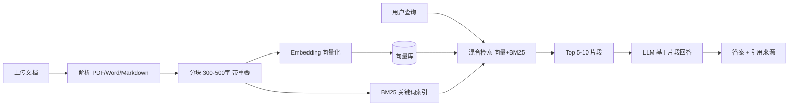

# RAG 改造汇报（草案）

## 1. 现状问题

旧知识库采用“上传文档 -> LLM 提取摘要 -> 检索时把整篇文档 + 摘要全量喂给 LLM -> 重新整理输出”。该方案存在 5 个主要问题：

1. 成本高：文档越多，单次查询输入量越大，token 费用线性膨胀。
2. 延迟高：大文档反复编码，用户体验差。
3. 上下文超限：文档一多一长就截断或失败。
4. 长文档细节丢失：摘要压缩信息，细节查不到。
5. 容易编造：大量不相关内容进入上下文，模型容易“参考”噪声并生成不准确答案。

## 2. 建议方案：混合检索 RAG

核心变化：从“全文进 LLM”改为“先检索再回答”。



默认技术选型（资源未确认前的可替换默认值）：Python + `pymupdf`/`python-docx` 解析；`bge-m3` 或云嵌入；Chroma/Qdrant 向量库；BM25 + 向量 RRF 混合；可选 `bge-reranker` 精排。

## 3. 离线原型成果

已交付一套可复跑的离线原型：

- 文档解析、标题/段落分块、三种嵌入后端（云/本地/离线哈希）自动切换
- 向量 + BM25 混合检索，RRF 融合排序
- 命令行检索、零依赖 Web 演示页
- 24 条离线评测集与指标脚本
- 摸底报告、问题案例集、黑盒观察记录表模板

复现命令：

```bat
python scripts\make_sample_docs.py
python scripts\build_index.py
python scripts\run_eval.py
python scripts\run_server.py
```

## 4. 离线评测结果

样本文档 9 篇、456 个片段、24 条查询（覆盖长文档细节、相似文档区分、同义改写、无答案场景）。

| 指标 | 数值 | 说明 |
| --- | --- | --- |
| Recall@10 | 1.000 | 期望文档都能在 Top10 召回 |
| Precision@5 | 0.167 | 每题期望 1 篇文档，满分为 0.2 |
| MRR | 0.708 | 期望文档平均首次命中约第 1.4 位 |
| 片段命中关键词率 | 0.950 | 检索片段包含答案关键词的比例 |
| RAG 平均输入 tokens | 756 | 单次查询喂给 LLM 的输入 |
| 全量方案平均输入 tokens | 11942 | 旧方案单次查询输入 |
| 成本比 | 约 6.9x | 旧方案输入成本约为 RAG 的 6.9 倍 |

说明：原型当前使用离线哈希嵌入验证链路；接入真实语义嵌入后，片段级命中率预期进一步提升。成本按 `.env` 单价估算。

## 5. 分阶段改造计划

| 阶段 | 内容 | 预计周期 | 验收标准 |
| --- | --- | --- | --- |
| 0 摸底 | 确认负责人、数据、日志、资源边界 | 1 周 | 完成摸底报告与问题案例集 |
| 1 检索服务 | 云嵌入 + 向量库 + 混合检索 API，先只返回片段 | 2-3 周 | Recall@10 >= 0.9，单次耗时可接受 |
| 2 生成增强 | LLM 基于片段回答 + 引用 + rerank | 1-2 周 | 答案引用准确率达标 |
| 3 生产化 | 增量更新、权限、监控、灰度、回滚 | 持续 | 新老双跑指标对比通过 |

## 6. 试点、灰度与回滚

- 试点范围：建议先选 500-1000 篇高频 FAQ/制度/操作手册。
- 灰度方式：新老系统双跑，同一查询分别记录结果、耗时、成本，按部门或文档集逐步切换。
- 回滚方案：保留旧接口，RAG 服务前置功能开关，指标异常时一键切回。

## 7. 风险与对策

| 风险 | 对策 |
| --- | --- |
| 公司不允许新增依赖 | 原型已提供零依赖离线模式，先演示，再申请试点环境 |
| 嵌入效果不达标 | 用评测集对比云嵌入、bge-m3、rerank，选最优组合 |
| 数据权限问题 | 试点先用脱敏/公开文档，权限过滤放到生产化阶段 |
| 旧系统改造阻力 | 不要求源码，先并行做独立 RAG 服务，灰度切换 |
| 成本估算不准 | 用真实 token 日志校准单价与输出长度 |

## 8. 需要领导支持的事项

1. 指定旧系统负责人并提供 30 分钟数据流介绍。
2. 开通样本文档、搜索日志读取权限。
3. 确认试点资源：embedding API 或 GPU、向量库实例、部署环境。
4. 确认试点范围、验收指标和切换决策人。

汇报人：__________  日期：__________
